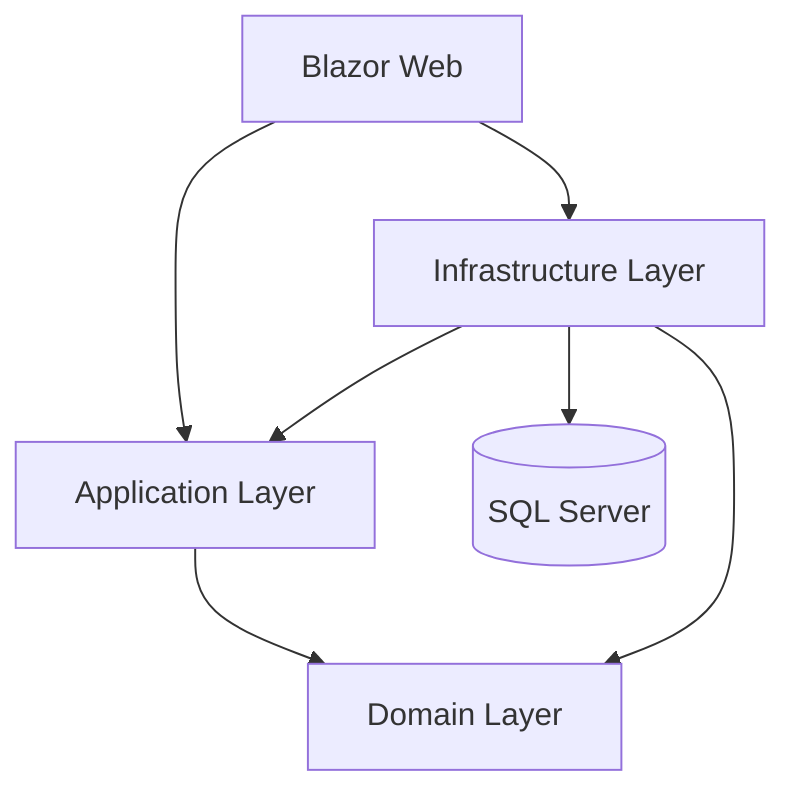

# Project Structure

```text
BloodLink/
|-- BloodLink.sln
|-- README.md
|-- CONTRIBUTING.md
|-- .editorconfig
|-- .gitignore
|-- global.json
|-- docs/
|   |-- PROJECT_BLUEPRINT.md
|   |-- PROJECT_STRUCTURE.md
|   |-- ARCHITECTURE.md
|   |-- DOMAIN_MODEL.md
|   |-- WORKFLOWS.md
|   |-- ACCESS_CONTROL_MATRIX.md
|   |-- TEAM_HANDOFFS.md
|   |-- TEAM_OWNERSHIP.md
|   |-- API_CONTRACTS.md
|   |-- DATABASE_GUIDE.md
|   |-- TESTING_STRATEGY.md
|   `-- reference/
|       `-- BloodLink_Revised_Master_Blueprint_and_Team_Handoffs.docx
|-- src/
|   |-- BloodLink.Web/
|   |-- BloodLink.Application/
|   |-- BloodLink.Domain/
|   `-- BloodLink.Infrastructure/
|-- tests/
|   |-- BloodLink.Domain.Tests/
|   |-- BloodLink.Application.Tests/
|   |-- BloodLink.Infrastructure.Tests/
|   `-- BloodLink.Web.Tests/
`-- scripts/
    |-- setup-development.md
    `-- database-setup.md
```



## Root

Root files define repository documentation, solution metadata, formatting, ignore rules, and SDK selection.

## docs

Project requirements, architecture, contracts, ownership, database, workflows, and testing guidance. `docs/reference` stores the authoritative Word blueprint.

## src/BloodLink.Domain

Shared entities and canonical enums. It has no project dependencies and must not contain EF Core, Identity, UI, or infrastructure code.

## src/BloodLink.Application

DTOs, service interfaces, role constants, policy names, validation contracts, and application boundary definitions. It references Domain only.

## src/BloodLink.Infrastructure

EF Core DbContext, Identity user, SQL Server registration, persistence, repositories, notification implementations, seed data, and future migrations. It references Application and Domain.

## src/BloodLink.Web

Blazor Server UI, account components, authorization integration, middleware, and static assets. It references Application and Infrastructure.

## tests

Each test project references only the project it tests. Broader integration and acceptance suites should be added in owned folders by QA and feature owners.

## scripts

Markdown setup guides for developers and database preparation.
