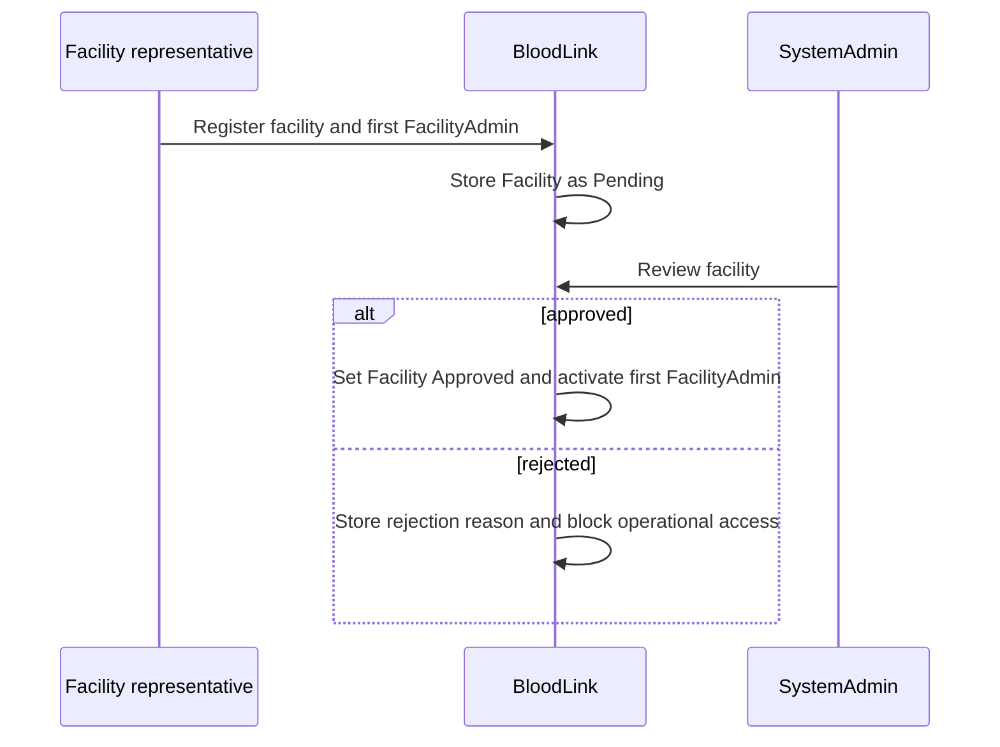
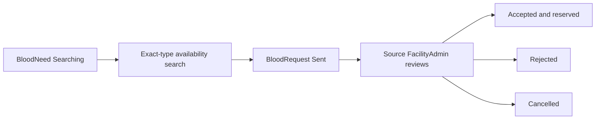

# Workflows

## Facility Registration

## Facility Staff Invitation or Creation

FacilityAdmin creates staff accounts only for their own approved facility. Staff receive temporary credentials and must change the temporary password on first sign-in.

## Staff Account Activation

Identity verifies credentials, active user status, role, FacilityId, and facility status. Pending, rejected, suspended, or inactive contexts cannot access operational pages.

## Internal Blood Request

FacilityStaff checks exact blood type stock. If insufficient, staff creates a BloodNeed with units, urgency, needed-by time, and a non-identifying note. The BloodNeed starts as PendingReview and active FacilityAdmins are notified.

## Insufficient-Stock Escalation

FacilityAdmin reviews PendingReview needs and may reject, cancel, fulfil internally, or move the need to Searching.

## Availability Search

FacilityAdmin searches approved active facilities by exact BloodType and minimum AvailableUnits. Search excludes the requesting facility and never exposes pending or suspended facilities.

## Inter-Facility Request

## Approval

Source FacilityAdmin accepts only if current AvailableUnits are sufficient. Acceptance atomically increases ReservedUnits and creates an inventory reservation transaction.

## Rejection

Source FacilityAdmin rejects with a reason. No inventory changes occur. The linked BloodNeed remains Searching so the requester can select another source.

## Fulfilment

After real-world handover confirmation, source FacilityAdmin marks the request Fulfilled. One transaction decreases source TotalUnits and ReservedUnits, increases requesting-facility TotalUnits, creates transfer-out and transfer-in transactions, and marks the linked BloodNeed FulfilledExternally.

## Cancellation

If an accepted request is cancelled before fulfilment, reservation is released and recorded. No stock transfer occurs.

## Inventory Adjustment

FacilityAdmin records stock-in, consumption, or manual adjustment for own facility only. Every change creates an immutable InventoryTransaction.

## Notification

Notifications are created for facility decisions, new needs, new external requests, request responses, fulfilment, low stock, account creation, and security events.

## Audit Logging

Every stock change, request transition, facility decision, staff-management action, and privileged security action creates an AuditLog with a safe summary.
