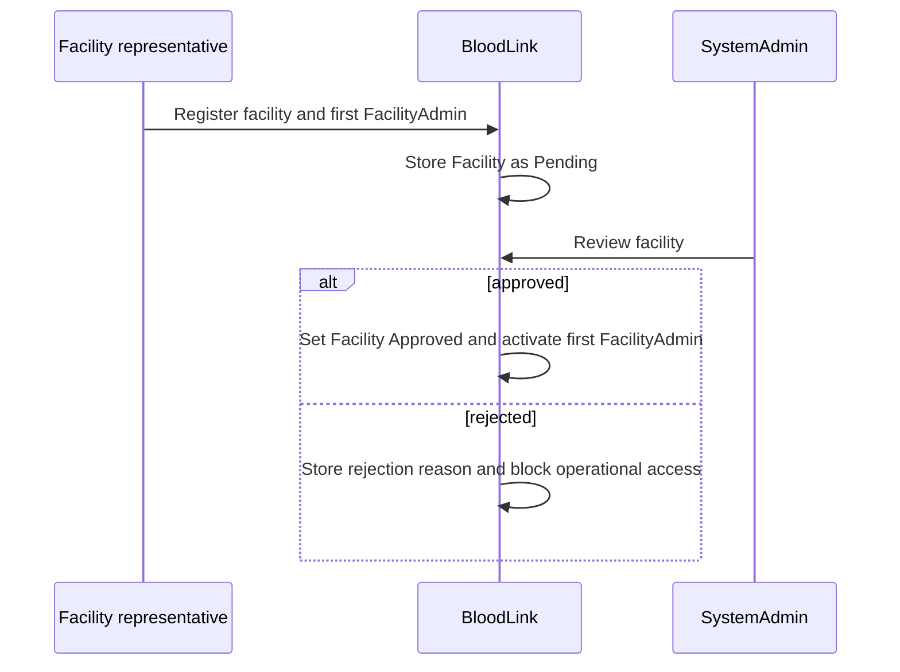
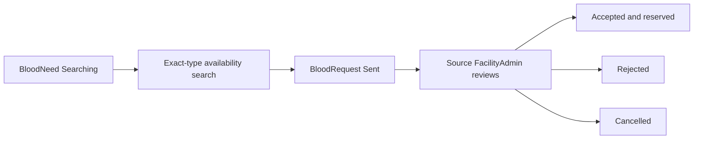

# Workflows

## Facility Registration

## Facility Staff Invitation or Creation

FacilityAdmin creates staff accounts only for their own approved facility. Staff receive a secure password setup/reset link through the configured delivery provider; the UI never displays a plaintext temporary password.

## Staff Account Activation

Identity verifies credentials, active user status, role, FacilityId, and facility status. Pending, rejected, suspended, or inactive contexts cannot access operational pages.

## Internal Blood Request

FacilityStaff checks exact blood type stock. If insufficient, staff creates a BloodNeed with units, urgency, needed-by time, and a non-identifying note. The BloodNeed starts as PendingReview and active FacilityAdmins are notified.

## Insufficient-Stock Escalation

FacilityAdmin reviews PendingReview needs and may reject, cancel, fulfil internally, or move the need to Searching. Every successful transition records immutable need status history, an audit event, and appropriate in-app notifications in the same persistence unit.

Need detail is available to its creating staff member and an active FacilityAdmin at the same approved facility. Its chronological timeline is projected from persisted `BloodNeedStatusHistory`, never synthesized from current status.

## Internal Fulfilment

An authorized FacilityAdmin may fulfil a need only from `PendingReview` or `Searching`, for a positive exact quantity and matching blood type. The service verifies `TotalUnits - ReservedUnits >= UnitsNeeded`, consumes exactly `UnitsNeeded` from `TotalUnits`, and leaves `ReservedUnits` unchanged. Inventory, immutable before/after transaction evidence, need status/history, audit, and creator notification commit atomically; concurrency conflicts leave no partial result.

## Availability Search

FacilityAdmin searches approved active facilities by exact BloodType and minimum AvailableUnits. Search excludes the requesting facility and never exposes pending or suspended facilities.

## Inter-Facility Request

Request submission rechecks exact-type availability for the selected approved source immediately before persistence, and does not reserve stock. A filtered unique index also prevents multiple active requests for one need.

## Approval

Source FacilityAdmin accepts only if current AvailableUnits are sufficient. Acceptance atomically increases ReservedUnits and creates an inventory reservation transaction.

## Rejection

Source FacilityAdmin rejects with a reason. No inventory changes occur. The linked BloodNeed remains Searching so the requester can select another source.

## Fulfilment

After real-world handover confirmation, source FacilityAdmin marks the request Fulfilled. One transaction decreases source TotalUnits and ReservedUnits, increases requesting-facility TotalUnits, creates transfer-out and transfer-in transactions, and marks the linked BloodNeed FulfilledExternally.

## Cancellation

Only an active FacilityAdmin at the approved source facility may cancel a `Sent` or `Accepted` request. The requesting facility admin, staff, platform admin, inactive users, and admins at non-approved or unrelated facilities cannot cancel. A sent request has no reservation to release. Cancelling an accepted request atomically releases exactly `UnitsAccepted` (including partial acceptance), leaves total stock unchanged, and records inventory, request-history, audit, and requesting-side notification evidence. The linked need remains `Searching` so the requester can choose another source.

Request timelines read immutable request status history oldest-first. Only active FacilityAdmins from either participating approved facility can read request detail or timeline.

## Inventory Adjustment

FacilityAdmin records stock-in, consumption, or manual adjustment for own facility only. Every change creates an immutable InventoryTransaction.

## Notification

Notifications are created for facility decisions, new needs, new external requests, request responses, fulfilment, low stock, account creation, and security events.

## Audit Logging

Every stock change, request transition, facility decision, staff-management action, and privileged security action creates an AuditLog with a safe summary.
