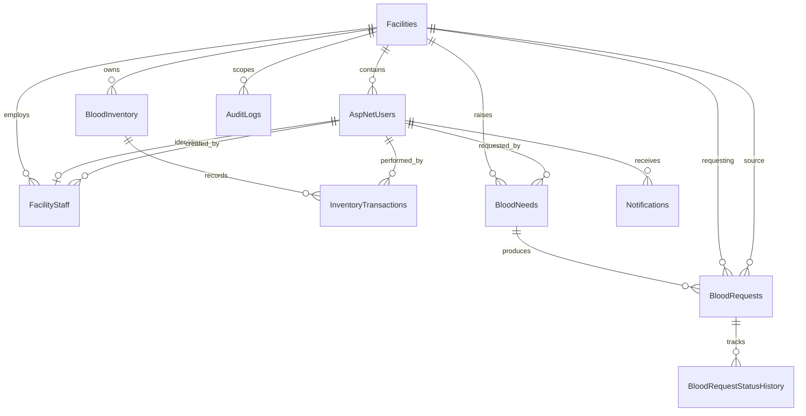

# Entity Relationship Map

All displayed operational relationships use `NO ACTION` deletion. `BloodRequest` also references users for request, response, and fulfilment; status history references its changing user; audit logs optionally reference an actor. Identity role, claim, login, and token tables use the standard ASP.NET Core Identity schema.

Facility creator/approver values are audit identifiers, not relational links, to avoid the circular facility/initial-admin insertion dependency.
