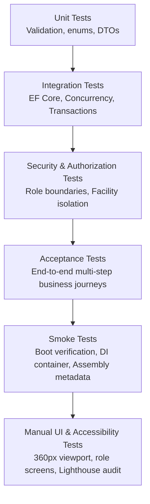

# BloodLink Quality Assurance Test Plan

**Document Version:** 1.0.0  
**Date:** 16 August 2026  
**Author:** Jennifer Banibensu, DevOps & QA/Test Engineer (Student ID: 22013023)  
**Project:** BloodLink — Hospital & Blood Bank Inventory Coordination System  
**Handoff Recipient:** Emmanuel Eyram Korku Agbetor, Project Manager / Team Lead (Student ID: 22206812)  

---

## 1. Introduction & Executive Summary

BloodLink is a web application designed exclusively for approved hospitals and blood banks to manage internal blood inventory and coordinate emergency inter-facility blood requests. 

### 1.1 Scope Boundaries & Locked Requirements
* **In Scope (MVP):**
  * Facility onboarding, public registration as `Pending`, and `SystemAdmin` review (`Approve`/`Reject`/`Suspend`/`Restore`).
  * `FacilityAdmin` creation and lifecycle management of `FacilityStaff` accounts for own facility only.
  * Role-based and facility-scoped access control (`SystemAdmin`, `FacilityAdmin`, `FacilityStaff`).
  * Blood inventory tracking by exact canonical blood type for each facility.
  * Internal blood needs submitted by `FacilityStaff` (`PendingReview`).
  * Network availability search performed by `FacilityAdmin` (exact-type, excluding requester, excluding pending/suspended facilities).
  * Inter-facility blood requests (`Sent`, `Accepted`, `Rejected`, `Fulfilled`, `Cancelled`).
  * Atomic reservations upon request acceptance and atomic multi-facility transfer upon handover fulfilment.
  * In-app notifications, role-aware dashboards, and immutable audit history.
* **Explicitly Excluded (Strict Prohibition):**
  * **No Donors:** No donor accounts, profiles, donations, eligibility rules, or donor notifications.
  * **No Clinical Decisions:** No automatic cross-matching, diagnoses, patient records, or AI recommendations.
  * **No Direct DB Access from UI:** Frontend Razor components consume DTOs exclusively.

---

## 2. Test Strategy & Test Levels



### 2.1 Test Levels & Ownership Matrix

| Test Level | Scope & Objective | Tools / Frameworks | Primary Owner | QA Role / Verification |
|---|---|---|---|---|
| **Unit Tests** | Verify domain entities, DTO validation, status transitions, and service logic in isolation. | `xUnit`, `Moq` | Feature Owners (Backend 1, 2, 3, Security) | Review assertions; verify 100% pass rate in CI. |
| **Integration Tests** | Verify EF Core configurations, unique constraints, transactional rollbacks, and queries. | `xUnit`, SQL Server / In-Memory | Database Developers 1 & 2 | Verify migration consistency and rollback atomicity. |
| **Security & Authorization** | Verify role enforcement, inactive user lockout, and facility tampering prevention. | `xUnit`, Test Claims Principal | Security Developer (Isaac Morrison Quaye) | Verify anonymous, wrong-role, and cross-facility rejection. |
| **Acceptance Tests** | Verify full end-to-end multi-role workflows across service boundaries. | `xUnit`, In-Memory DbContext, Service Stubs | DevOps & QA (Jennifer Banibensu) | Author and maintain acceptance suites. |
| **Smoke Tests** | Ultra-fast validation that the web host boots, DI resolves, and database connects. | `xUnit`, WebApplicationFactory | DevOps & QA (Jennifer Banibensu) | Gating check before running deeper test suites. |
| **Manual UI & Accessibility** | Responsive layout at 360px mobile / desktop, WCAG contrast, keyboard navigation. | Browser DevTools, Lighthouse, Axe | Frontend 1, 2, 3 & QA | Visual walkthrough against design specifications. |

---

## 3. Feature Area Test Plans

### 3.1 Facility Onboarding & Staff Management
* **Assigned Backend Owner:** Poku Nancy (Backend Developer 1)
* **Assigned Frontend Owner:** Selorm Sem (Frontend Developer 1)
* **Status:** *Waiting on Backend 1 Service Implementation*
* **Test Plan:**
  1. *Public Registration:* Submitting valid registration creates a `Facility` in `Pending` status and an inactive first `FacilityAdmin`.
  2. *System Admin Approval:* `ApproveAsync` transitions facility to `Approved` and activates the initial admin.
  3. *System Admin Rejection:* `RejectAsync` requires a reason, marks status as `Rejected`, and prohibits operational access.
  4. *Staff Provisioning:* `FacilityAdmin` can create staff only within their own approved facility.
  5. *Staff Deactivation:* Deactivated staff accounts are blocked from authentication and operational use.

### 3.2 Inventory Management & Availability Search
* **Assigned Backend Owner:** Jephthah Peprah (Backend Developer 2)
* **Assigned Frontend Owner:** Fauziya Adjeley Adjei (Frontend Developer 2)
* **Status:** *Waiting on Backend 2 Service Implementation* (Staged via `FakeInventoryService`)
* **Test Plan:**
  1. *Invariant Verification:* Ensure `TotalUnits >= ReservedUnits >= 0` under all adjustment scenarios.
  2. *Adjustment Types:* Stock-in, Consumption, and Manual Correction each generate an immutable `InventoryTransaction`.
  3. *Availability Search:* Search for exact blood type returns approved active facilities with sufficient available units (`TotalUnits - ReservedUnits`), strictly excluding the searcher's own facility.
  4. *Pending/Suspended Isolation:* Never return stock from pending or suspended facilities in network search.

### 3.3 Internal Blood Needs
* **Assigned Backend Owner:** Jedidiah Nii Saban Delali Annan (Backend Developer 3)
* **Assigned Frontend Owner:** Eastwood Tweneboah Osei (Frontend Developer 3)
* **Status:** **Ready & Fully Covered** (`InternalNeedAcceptanceTests.cs`)
* **Test Plan:**
  1. *Creation:* Staff creates need with future `NeededByUtc` and positive whole units; status starts as `PendingReview`.
  2. *Escalation to Search:* `FacilityAdmin` moves need to `Searching`.
  3. *Internal Fulfilment:* `FacilityAdmin` marks need `FulfilledInternally` when stock arrives locally.
  4. *Rejection / Cancellation:* Rejection requires a reason; creator can cancel before admin acts.

### 3.4 Inter-Facility Blood Requests & Fulfilment
* **Assigned Backend Owner:** Jedidiah Nii Saban Delali Annan (Backend Developer 3)
* **Assigned Frontend Owner:** Eastwood Tweneboah Osei (Frontend Developer 3)
* **Status:** **Ready & Fully Covered** (`RequestResponseAcceptanceTests.cs`, `ReservationAcceptanceTests.cs`, `CancellationAcceptanceTests.cs`, `FulfilmentAcceptanceTests.cs`, `EndToEndRequestFlowAcceptanceTests.cs`)
* **Test Plan:**
  1. *Request Initiation:* Request created from `Searching` need transitions to `Sent` and notifies source admins.
  2. *Acceptance & Reservation:* Source admin accepts, atomically incrementing `ReservedUnits` at source facility.
  3. *Cancellation Release:* Cancelling an accepted request releases reservation back to available stock.
  4. *Fulfilment Transfer:* Handover confirmation transfers stock between facilities and sets need to `FulfilledExternally`.

### 3.5 Dashboards & Notifications
* **Assigned Backend Owner:** Jedidiah Nii Saban Delali Annan (Backend Developer 3)
* **Status:** **Ready & Fully Covered** (`DashboardsAcceptanceTests.cs`, `NotificationsAcceptanceTests.cs`)
* **Test Plan:**
  1. *Notifications:* Verify targeted delivery for `NewNeed`, `NewExternalRequest`, and `RequestResponse`.
  2. *Dashboard Metrics:* Facility dashboard counts only open needs and active requests.

---

## 4. Test Environment & Automation Pipeline

### 4.1 Continuous Integration Workflow (`.github/workflows/ci.yml`)
Every pull request and push to `main` executes the following automated pipeline:
```yaml
name: CI
on:
  pull_request:
    branches: [ main ]
  push:
    branches: [ main ]
jobs:
  build-and-test:
    runs-on: ubuntu-latest
    steps:
      - uses: actions/checkout@v4
      - name: Setup .NET
        uses: actions/setup-dotnet@v4
        with:
          global-json-file: global.json
      - name: Restore
        run: dotnet restore
      - name: Build
        run: dotnet build --no-restore --configuration Release
      - name: Test
        run: dotnet test --no-build --configuration Release --verbosity normal
      - name: Format check
        run: dotnet format --verify-no-changes
```

### 4.2 Local Test Execution Commands
To execute the complete QA suite locally:
```bash
dotnet restore
dotnet build --configuration Release
dotnet test --configuration Release --verbosity normal
dotnet format --verify-no-changes
```

---

## 5. Pass/Fail & Exit Criteria
* **Build Integrity:** Zero compiler warnings treated as errors, clean build across all projects.
* **Automated Test Pass Rate:** 100% passing tests (zero test failures, zero regressions).
* **Code Formatting:** `dotnet format --verify-no-changes` passes with zero violations.
* **Scope Verification:** Zero donor-related code, tables, DTOs, or terminology present in repository.
* **Handoff Requirement:** All deliverable documentation and acceptance evidence approved by Project Manager.
